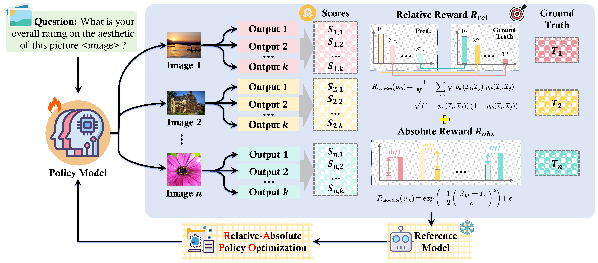

# Unlocking the Essence of Beauty: Advanced Aesthetic Reasoning with Relative-Absolute Policy Optimization

<div align="center">

</div>

# 📰News

# 🖥️Training
## Preparation
1. First download the IAA datasets and place them all in a single folder.
2. Construct your image-score dataset in the following format:
```json
{
    "messages": [
      {
        "content": "prompt here",
        "role": "user"
      },
      {
        "content": "response here",
        "role": "assistant"
      }
    ],
    "images": "image_path_1"
  },
```
we provide an example dataset in `AesR1/data` folder.
3. Download the pre-trained model weights from [here](https://huggingface.co/Qwen/Qwen2.5-VL-7B-Instruct) and place them in `AesR1/models` 

## Cold-start
We use [LLaMA-Factory](https://github.com/hiyouga/LLaMA-Factory) to train the SFT model.

1. Clone the [LLaMA-Factory](https://github.com/hiyouga/LLaMA-Factory) repository and install the dependencies.

```bash
git clone https://github.com/hiyouga/LLaMA-Factory.git
conda create -n coldstart python=3.11.10
conda activate coldstart
cd LLaMA-Factory
pip install -e ".[torch,metrics]"
```
2. Put your cot dataset info in `LLaMA-Factory/data/dataset_info.json` and move `qwen_aescot.yaml` into `LLaMA-Factory/examples/train_full`
3. Run the following command to train the SFT model.

```bash
llamafactory-cli train examples/train_full/qwen_aescot.yaml
```

## RAPO
First setup the environment for RAPO training.
```bash
conda create -n rapo python=3.11.10
conda activate rapo
bash setup.sh
```
After modification, run the following command to train the RAPO model.
```bash
# For single node training
bash train/rapo/src/open-r1-multimodal/run_scripts/Aes/aes_onenode.sh

# For multi node training
bash train/rapo/src/open-r1-multimodal/run_scripts/Aes/aes_multinode.sh
```

# Inference
After training, you can inference the model by using the scripts in LLaMA-Factory.

```bash
#Install vllm
pip install vllm

#Infer
python scripts/vllm_infer.py \
--model_name_or_path [path/to/your/model] \
--dataset [dataset_name] \
--template qwen2_vl  \
--save_name result.jsonl \
--temperature 0.6 \
```

# 📋Example
<div align="center">

</div>

# 🙏Acknowledgement
Special thanks to the following repositories for their invaluable code and datasets
- [VLM-R1](https://github.com/om-ai-lab/VLM-R1)
- [Visualquality-R1](https://github.com/tianhewu/visualquality-r1)
- [LLaMA-Factory](https://github.com/hiyouga/LLaMA-Factory)
- [open-r1](https://github.com/huggingface/open-r1)

# 📚 Citation